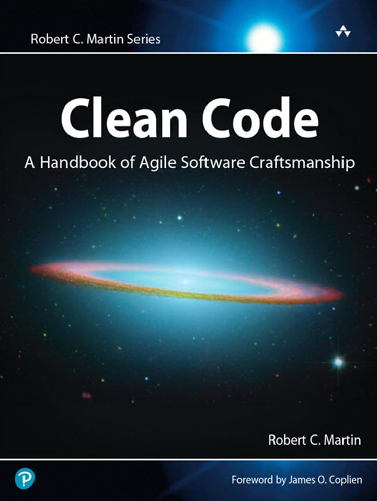

# Clean Code: A Handbook of Agile Software Craftsmanship

Clean Code is a very good book that every developer should read to improve him/her coding skills and be able to get the "code-sense" ability. At the same time, it is relevant to understand that this book contains a compendium of thoughs of how code should be, but this doesn't imply that is the way that have to be all the time, so understand each point, be critic, and apply when needed.

It is important to note that only were transcripted the more relevant listings for the explanations of each chapter. Also, some listings can be executed if the folder that contains it have a README file explaning how to execute it/them. 

You can adquire this book through this [link](https://www.amazon.com/Clean-Code-Handbook-Software-Craftsmanship/dp/0132350882).

## Book Cover

