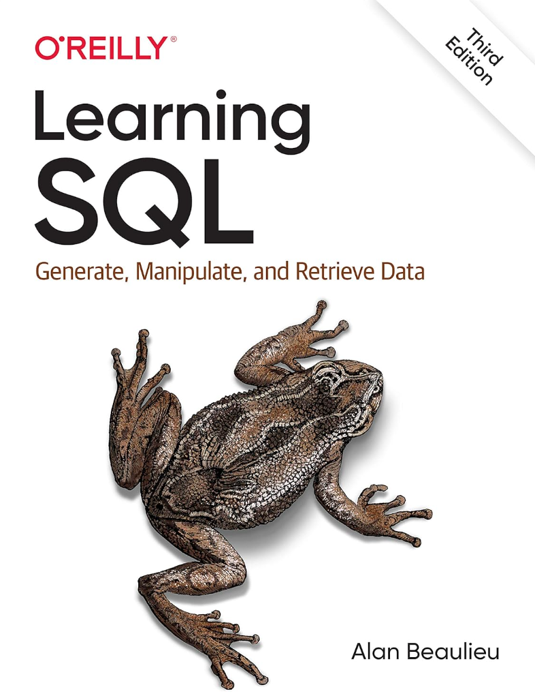

# Learning SQL: Generate, Manipulate, and Retrieve Data 3rd Edition

Learning SQL is a really good book to introduce yourself into the nuances of SQL. As you go through the different chapters you will be able to understand concepts like:

* Data types
* Searching data
* Updating data
* Transforming data
* Indexing, partitioning, and much more...

You can adquire this book through this [link](https://www.amazon.com/Learning-SQL-Generate-Manipulate-Retrieve-ebook/dp/B085HDSWR3/ref=sr_1_6?s=books&sr=1-6).

## Book Cover

