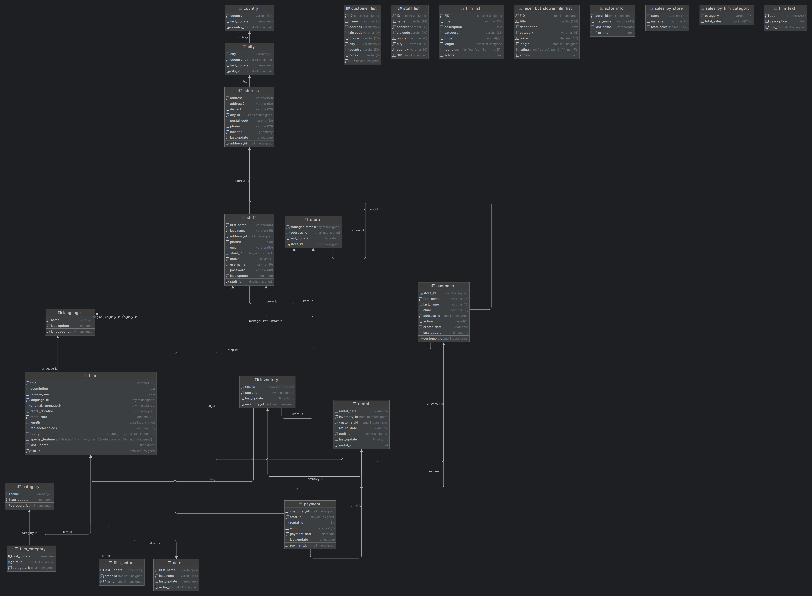

# Sakila Database

The Sakila database is an example database about a movie rental business. It has tables like:

* customer
* rental
* payment
* movie
* staff
* etc

All with the purpose to mimic the data that this type of business could have.

## Sakila Database and the Book

The book uses the data from this database to convey all the SQL concepts that it teaches, therefore creating this database is important to get a good grasp of all the concepts by practicing.

## Database Creation

To create this database, a docker-compose file was created with the purpose to make the process very straightforward. You only have to run the next command and the database along with his data will be created inside a container:

```
sudo docker compose up -d
```
> -d flag is for detached mode (Run containers in the background)

After running this command you only have to connect with the database using any database IDE that you could have.

The docker-compose file creates two volumes (In addition to the container and the network). One docker volume to store the data of the database called `mysql-sakila-db-data` and one bind mount volume linked to the path `/docker-entrypoint-initdb.d` to execute the SQL files inside the `data` folder and therefore create the Sakila schema and insert all the data.

## Sakila Database Schema

To understand better the schema of this database, here is an image with all the tables and views:




